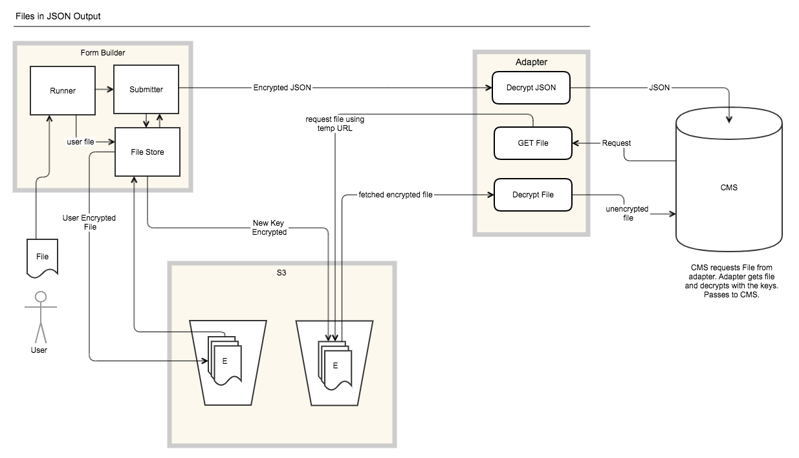

# 3. Files in JSON Output

Date: 2019-08-27

## Status

🤔 Proposed

## Context

When users submit forms created by Form Builder the data from the user needs to
be handed over to other systems for processing. This is fulfilled by the JSON
output generated. One category of data which can be present is that of files in
the form of documents, images and other files users may upload as part of their
form submission.

In order to hand over these files to other systems they need to be somehow
present in the JSON.

Considerations taken on board were security, ease of implementing and ease of
integration. We need to consider that the data is sent securely and should only
be accessible by the intended recipient. The solution should be cost effective
and therefore cheap to implement and maintain. Integrating systems should able
to receive files with ease therefore able to provide cost effective solutions.

We don't know, but suspect, that the various CMSs (Case Management Systems)
which JSON submissions would eventually end up in will take very different
approaches to ingesting files associated with a submission. This could include
but not limited to:

- File is encoded and embedded in a POST request to the CMS.
- POST a URL to the file for the CMS to retrieve via HTTP sync or async and
store itself.
- POST a URL to the file for the CMS to retrieve via (S)FTP sync or async and
store itself.
- POST a URL to the file where the CMS will expect to be able to retrieve it
from on demand forever.
- POST a URL to the file where the CMS expects its user to manually download
the file (and then reupload into the CMS).
- (S)FTP into the CMS.

Form Builder is not in the business of supporting all these options directly,
just as it is not in the business of making data submission requests using
arbitrary formats, authentication, protocols etc. We need to define a standard
approach which Form Builder can support (ideally at scale), with clear
boundaries of responsibility between the platform and its users.

We have discussed the pros and cons of 6 possible options:

### 1. Include files in JSON document as Base64 encoded strings

Pros:

- Super simple with a single POST of entire payload.
- We can delete all data once submission has been handed over.

Cons:

- Potentially a large POST body.
- Files will be Base64 encoded which will increase size of payload and
processing.
- Clients will have to decode file.

### 2. Embed signed many use AWS S3 URL in JSON

This option is not possible as we encrypt files before they reach S3. Therefore
the client downloading the file would have to know the decryption key and
decrypt the file.

Pros:

- Lightweight JSON payload.
- S3 deals with files.

Cons:

- We must retain files for client to pick up.
- Client must pick up file within 1 week (S3 constraint).
- We can only retain files for 28 days.
- An Exposed link will lead to unencrypted files being available for download.
- If client does not pick up data within 28 days the submission files will be
lost.

### 3. Embed signed Form Builder URL.

This is similar to option 2. However, instead of embedding an S3 URL we can
embed a custom Form Builder generated URL that we have control over. This would
requires Form Builder to have an extra application to deal with this flow.

As the files on S3 are encrypted by form builder. This application will have to
proxy file upload and download, encrypting and decrypting files respectively.

Pros:

- Lightweight JSON payload.
- S3 deals with files.
- Finer grain control of tokens.
- We are able to regenerate new tokens up to the maximum 28 day limit.

Cons:

- We must retain files for client to pick up.
- We can only retain files for 28 days.
- An Exposed link will lead to unencrypted files being available for download.
- If client does not pick up data within 28 days the submission files will be
lost.
- Requires additional ingress.
- Need another Form Builder Application to handle this flow.
- This will likely become a performance bottleneck.
- Still constrained by S3 28 day limit.

### 4. Multipart POST which includes JSON and files

Pros:

- No need to Base64 encode files.
- We can delete all data once submission has been handed over.

Cons:

- Potentially large POST request.
- Need some sort of convention to tie multipart files to JSON representation.

### 5. Decrypt S3 files after submission and embed signed S3 URL

This is option 2, but since the files in S3 are encrypted we decrypt the file
after submission. We then generate a signed S3 url which can be handed over to
another system.

Pros:

- Lightweight JSON payload
- S3 deals with files

Cons:

- We must retain files for client to pick up.
- Client must pick up file within 1 week (S3 constraint).
- We can only retain files for 28 days.
- An Exposed link will lead to unencrypted files being available for download.
- If client does not pick up data within 28 days the submission files will be
lost.
- Work needs to be done so post submission files are decrypted in S3 and
associated back to submission.
- We will now be storing some files in S3 which are unencrypted.

### 6. Store and serve PSK-encrypted files directly from S3

- Expect the receiver to retrieve the files as opposed to Form Builder sending
them.
- Move the files to a separate S3 bucket (so it can have different permissions
from the user datastore bucket) as part of processing a JSON submission.
- Encrypt the files with a pre-shared key (PSK).
- Serve the files encrypted, and expect the receiver to decrypt them with the
PSK.
- Use S3 native signed URLs (without a proxy application).
- Have a 1 week expiry time on the signed URLs.

Pros:

- Lightweight JSON payload.
- S3 deals with files.
- Files are encrypted for the next thing that needs them.
- Files continue to be stored encrypted.

Cons:

- We must retain files for client to pick up.
- Client must pick up file within 1 week (S3 constraint).
- We can only retain files for 28 days, so if client does not pick up data
within 28 days the submission files will be lost.
- The additional complexity it puts onto an adapter may put some users off this
approach altogether, resulting in them using email submissions (probably less
secure and more manual work involved) or not using Form Builder at all.
- We may end up building and maintaining a large number of adapters ourselves,
but outside the bounds of the platform, resulting in us still having to deal
with all the complexity of integrating with all the CMSs but with more layers of
abstraction involved.

## Decision

There are actually several decisions involved in these options:

### How far Form Builder has a responsibility to help platform users deal with the range of possible ways that CMSs could expect to ingest files

Form Builder may help on an individual basis by building adapters outside the
platform, preferably to be owned by another entity. However Form Builder should
offer a mechanism that enables these entities to be able to integrate with other
systems. All the above options offer a way for other systems to integrate with
Form Builder.

### Whether to send files to the receiver or let them know they should request them from Form Builder

The latter is more likely to be reliable and scalable, so proceeding on this
basis this excludes options 1 & 4.

### Whether to encrypt the files

With regards to encryption there are 2 areas where the file can be encrypted:

- At rest.
- In transit to the receiver.

Options 2 & 5 would require the file to be stored unencrypted for some period of
time before handed over.

Excluding TLS, for options 1, 4 & 6 the file is encrypted and required the
client to decrypt with known PSK.

### How long to keep files retrievable for

Whether directly available from S3 or through a proxy application by the
receiver. In some use cases this may involve human intervention to get files
into the CMS.

Options 1 & 4 are the only push options regarding the transfer of files which
leaves the client to hold the files indefinitely. Whereas the options are pull
options and due to constraints of S3 the files will only be available for at
most 1 week.

### Whether to use S3 native signed URLs or generate and manage our own signed URLs

If the latter, whether to only generate single-use signed URLs on request
(with those requests authenticated as being from the receiver) or whether to use
time-limited URLs, possibly with ability to revoke them on callback confirming
that the receiver has successfully retrieved and stored the file.

The negative of Form Builder managing its own signed URLs is the additional work
required to build and maintain this feature. This application needs to maintain
state so it knows what URLs are available, whether or not they've been used or 
if they have expired or not.

As a result choosing option 3 would require additional work.

### Issues concerning encryption:

- If we don't encrypt the file for the receiver in S3, or make it available at a
URL unencrypted, then we need to be much more careful about bucket
misconfiguration, short lived URLs, revokable URLs, alerting on reuse of URLs,
attempts to traverse/enumerate bucket contents should be considered to prevent
attempts to gain access from unintended audiences. This leaves a negative point
for options 2, 3 & 5.

- If we do encrypt the files in S3, we don't need to worry so much about
accidental misconfiguration of the bucket or attempts to traverse/enumerate it -
even if we don't have a proxy application in front of it. A pro for options 1, 4
& 6.

- If we encrypt the files in S3 and also serve them encrypted, then we don't
need to worry as much about bucket-level access to the files. This is a pro
again for options 1, 4 & 6.

- A proxy application is needed if the adapter does not have the responsibility
of decrypting the files. A proxy would not be needed if the responsibility of
decryption is moved to the adapter. However some kind of pre-shared key
mechanism would be needed. So option 3 would require building an extra
application, where as option 6 just needs handing over a PSK.

- This also follows the principle of all user-submitted data in Form Builder
always being encrypted for the next thing that needs it - user, then submitter,
then receiver. After the user uploads the file, it is processed then encrypted
for storage ready for submission. On submission it will be accessed and
re-encrypted ready for transmission to the receiver. The receiver will then
decrypt the file with a PSK ready for further processing. Options 1, 4, & 6 are
the only options where files are encrypted to the receiver.

- For option 6 it would probably be fine to use native S3 signed URLs that are
valid for 1 week, because if the URL is exposed then the file you can fetch from
is encrypted so we can worry less about expiring the URLs as soon as possible.

- Alerting on unusual patterns of requests on signed URLs might still be nice to
have, but that's getting into anomaly detection which isn't that easy to do and
may be of little benefit if we go down this route compared to others.

- How long we need or want to keep files retrievable for depends on whether
they're served encrypted or not, how long retrieval will take after submission,
and whether it's feasible to expire links after a single use or when Form
Builder is notified that the file has been successfully retrieved and stored
elsewhere as knowing we've served the file successfully doesn't guarantee the
other side has it. Having the files encrypted at rest is therefore beneficial
therefore in favour of options 1, 4 & 6.

### Issues concerning the revoking of signed URLs:

S3 signed URLs expire after a given time, and not after a number of uses - if we
want to do the latter we would have to implement a proxy application.

Revoking a S3 signed URL on demand involves removing the permissions of the IAM
user who signed the URL, so we couldn't expire individual URLs ourselves after
we know they've been used successfully unless we also generate a new IAM user to
sign each URL for each file. This is presumably possible but not ideal. So
revoking signed URLs on demand may also mean using a proxy application.

CMSs which retrieve files directly themselves are unlikely to be able to notify
us when they've successfully fetched the file - a decrypting adapter could make
this callback, but probably wouldn't know whether the CMS had stored the file.

This whole question means that Form Builder needs not to care too much about
what's happening a long way downstream.

Options 1 & 4 don't expose S3 URLs so are excluded for this argument. For
options 2, 3 & 5 the files are not encrypted therefore a concern whereas for
option 6 is encrypted therefore less of a concern. Picking up a encrypted blob
will only be an issue if the PSK is compromised as well.

### Conclusion

Considering all the points above option 6 has been chosen.

It leaves a clear cut boundary between Form Builder and integrations. Although
the responsibility of decrypting files is now in the hands of the receiver. The
Form Builder team does not need a proxy application and S3 can be left to handle
files.

It deals with encryption: files are kept encrypted at rest and only decrypted
when being processed. They leave the form builder ecosystem encrypted allow the
next system to decrypt the files their end.

Signed URLs are less of a concern as the files themselves are encrypted as they
leave S3.

### First use case

For HMCTS Complaints Form this would mean that the CMS would have to fetch the
files through the adapter so they can be decrypted. So this is what a JSON
submission including uploaded files looks like:

- Form Builder makes JSON request (including S3 signed URLs) to adapter
- The adapter decrypts the JSON, and POSTs the submitted data to the CMS,
including adapter links to the files
- CMS requests the files from the adapter
- The adapter fetches the file from S3, decrypts it, and responds with it to the
CMS
- CMS stores the files

This option takes a clear-cut approach to responsibilities and security. It's
one of the more feasible options in the timescale we have for HMCTS complaints,
since it doesn't involve building a proxy application.

## Consequences

### Risks

As for creating any API allowing for integrations there will always be the off
chance that if any information is obtained by unintended audiences they could be
able to access files.

### Benefits

The benefits of introducing these changes are that files in form submissions in
Form Builder will now be available outside of Form Builder through an API. This
means other systems will be able to process user form submissions. These will be
available through a JSON API which should not be difficult for other systems
to integrate with.

For the duration of handing over the files, the files remained encrypted
throughout the Form Builder ecosystem except for several points in memory when
being processed and when exiting the ecosystem.

