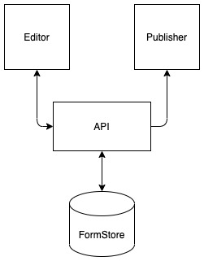

# 7. Replacing the storage

Date: 2020-10-12

## Status

✅ Accepted

## Context

The center of the Form Builder Platform is the form metadata, which is a collection of json files. These files are created by the Editor application and stored into Github using Git to version and transfer. The Editor does not interact with any of the services instead it produces a collection of files which is finally stored into Github. A link to Github is then used by the Publisher to obtain the files and create the form online.

Github was chosen due to it giving transparency, versioning, some form of collaboration, data ownership and it could be integrated to the local services easily being built. Another reason was that the user base for Form Builder would be Developers who would have an understanding of version control and git and therefore be beneficial.

### Why the change

There is a shift in the product proposal moving from a supported model to a full self service model, this has shown that using git and github is a blocker or at least friction point for new users. Also, to facilitate this move to being a true Self Service platform the method of user intervention between the editor and the publisher.

## Decision

Remove the use of git and github to store the form metadata.

## Solution

Move saving the form metadata from github to a database and having an API to manage it.

The new service will be hosted in Cloud Platform and utilise Postgres for the database and using Ruby on Rails for the API.

Connections between services will use the current methods the platform uses.

Having an API the data will be available through the authorised applications only.

The metadata will be stored with a version number giving the ability to use a specific version when editing/publishing.

Make sure the form builder principles are upheld.

The database will have a scheduled backup and Disaster Recovery plans will be published in the MOJ Online Runbook.

## Consequences
The form data will not be stored in public by default. This can be mitigated in a future release.