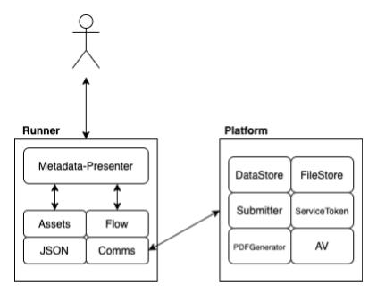

# 8. The Runner

Date: 2020-12-17

## Status

✅ Accepted

## Context

The Runner is the application that is a live form. It uses the metadata generated building a form to create the interactive online form. The current runner codebase is nodejs and when a form is published it is a self contained form running with it’s own ingress and url in the services namespace (i.e. formbuilder-services-live-production).

[How the Current Runner Works](https://github.com/ministryofjustice/form-builder/blob/master/documentation/running/runner/runner--sequence.md).

Reason why we have the current architecture:
* designed in collaboration with the security team
* keep the forms as distinct entities
* each form can be scaled independently
* an error in one form does not impact the other forms

### Why Rebuild the Runner
The team has embarked on changing it’s offering and moving towards a self service model which the current editor could not fulfil.

Replacing the storage mechanism from Gtithub to our own storage was the first part of this [ADR](https://github.com/ministryofjustice/form-builder/blob/master/decisions/0007-replacing-the-storage.md).

As the current Runner is used in both the editor and the live forms so that the preview is exactly a representation of the live form (using the same code)

After a review of the code base it was felt that rewriting this service would be beneficial for the following reasons:
1. The Editor will be developed using a different technology, making it more complicated to use the runner to preview the form from within the Editor
2. The current codebase works well and does exactly as expected but was difficult to follow and make changes
3. There was a noticeable lag between pages on some forms

## Runner Architecture
The runner will be kept as a single tenant, allowing each published form to run independently.

The design for the runner will also change as well as the technology.

From a nodejs codebase, the decision is to use Ruby (and Rails) to create the new Runner (and Editor). The Tech Team has more experience with Ruby, enabling quicker development and feature roll out.

## Metadata-Presenter
This is a Ruby Gem which will take valid form metadata (in a json format) and convert it to valid HTML using the GOV.UK design system components. This gem will be consumed by both the Runner and the preview feature in the new Editor.

## The Runner
Provides the form metadata at startup to the presenter, defines the routes (flow), connection to the backend services (Comms) and holds all the assets.
