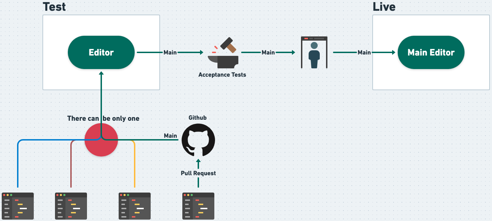
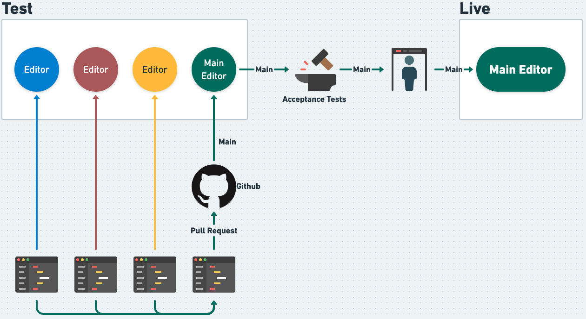

# 10. Testing the Editor Pipeline

Date: 2021-05-26

## Status

Accepted

## Context

Our pipeline follows a continuous delivery method with the manual gate to release to production.

We have one Editor in test which causes issues when the rest of the team want to test a feature. Also, while the Editor is tied up in testing the pipeline is blocked for deploying to live-production.

## Decision

The main problem to solve is having a feature that is being developed available to the wider team to test. Running locally was not considered as the MOJ Macbooks are locked down to those outside of the technical disciplines.

Changing the pipeline to create an Editor (all plugged in to the dev and test environments). This will involve, building and deploying the editor code into a pod and attaching to a unique URL. Not every branch will need to create a new test editor, the developer will need to add "testable-" to the beginning of the branch name (i.e. `testable-my-really-awesome-feature`).

The Editor will use the current auth mechanism unless the effort outweighs the investment. At a mimimum, basic auth of a set username and password must be added.

Test Editor must be cleanly removed after it has fullfilled it's purpose. This should ideally be automated either triggered by merging the branch or via commandline.

## Consequences

* Each testable editor will have it's own URL
* PR's are raised after QA by the rest of the team
* Main will continue be the single source for deploying through the pipeline
* Acceptances test will still run against the main branch and at a later date look at running them against a testable editor
* Clean removal of the testable editor will keep the neamespace managed

### Constrainsts
* The branch being worked on needs to be regually rebased
* Database changes will cause many, many issue
