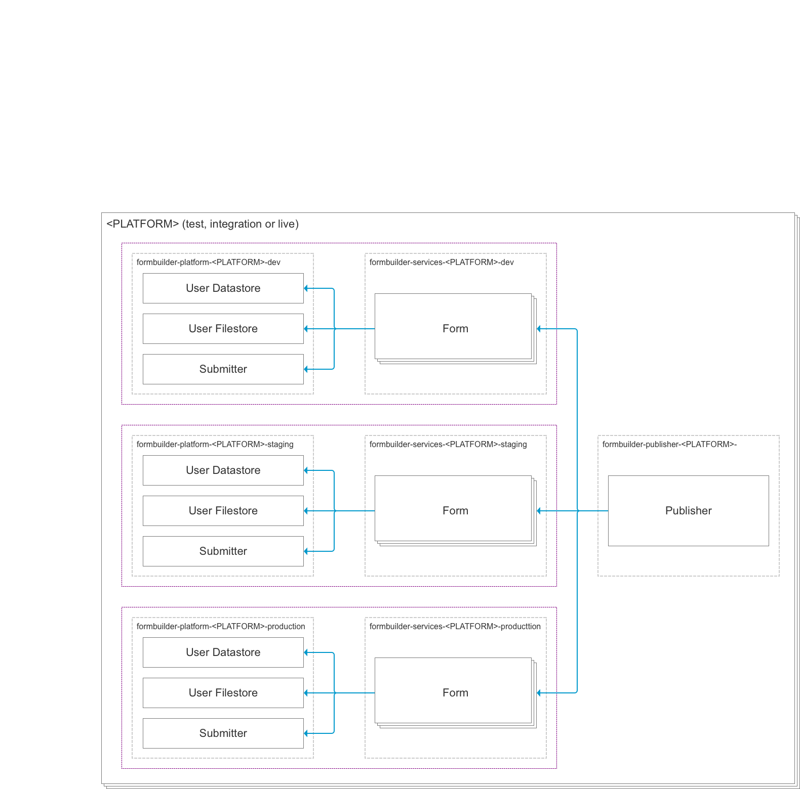

# Form Builder environments

## Platform environments

- live - For live deployed forms
- test - For development purposes

A platform environment contains a publisher which may deploy forms to any of its deployment environments

## Deployment environments

A platform environment contains the following deployment environments

- dev
- production

Each deployment environment contains 2 namespaces

- Platform apps - `formbuilder-platform-{$PLATFORM_ENV}-{DEPOYMENT_ENV}`
- Service apps - `formbuilder-services-{$PLATFORM_ENV}-{DEPOYMENT_ENV}`

Individual forms are deployed as separate instances in the service apps namespace as runners are single tenanted

Apps within platform namespace are shared by all the forms in the corresponding service apps namespace

([Source file (Axure)](files/fb-platform-environment-overview.rp))
