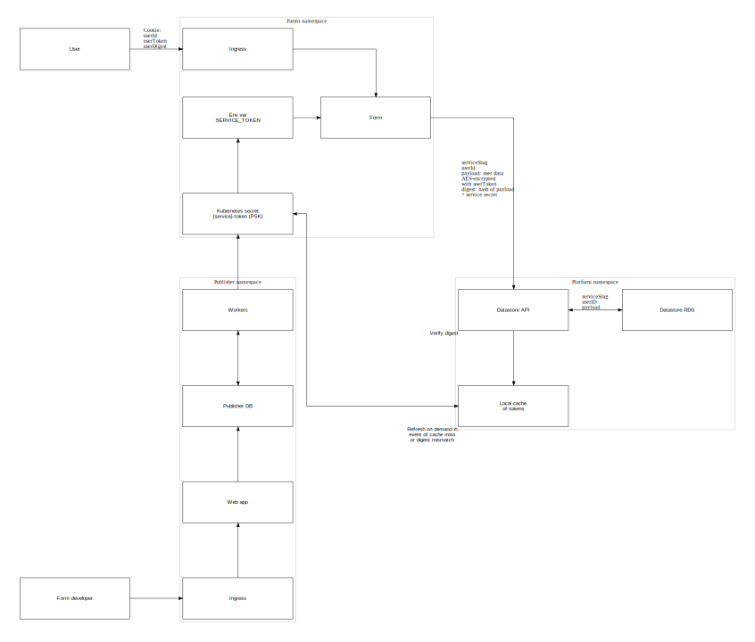

# User Datastore - Threats and mitigation

Users will be submitting potentially many different pieces of potentially very sensitive information to many services deployed on Form Builder. This data will not be permanently stored, but must be stored temporarily to allow a user to complete their journey.

Such a large cross-section of personal information must be stored and managed carefully. This document outlines the proposed model to mitigate each identified risk.

## Network Segmentation / Isolation

The internet-facing Runner services will not have direct access to the datastore, only via API calls. The API will exist in a separate namespace from the Runner services, and only the API pods will have access to the backing database.

## Security in transit

We will use TLS for communication between the Runner and the datastore. Implementation mechanism TBD, but we will experiment with an internal load balancer model (see https://kubernetes.io/docs/concepts/services-networking/service/#internal-load-balancer and https://kubernetes.io/docs/concepts/services-networking/service/#ssl-support-on-aws ) until Cloud Platforms provide a service mesh (e.g. https://istio.io  )
In this way, we can mitigate the risk of a Man-In-The-Middle attack between the Runner and the datastore API.

## Security at rest

The backing datastore (eventual aim is DynamoDB, but we will use Postgres at least until the cloud platform DynamoDB module is ready) will be encrypted automatically by the AWS infrastructure, thus mitigating risk of a ‘rogue datacenter staff’ attack

An attacker who managed to gain shell-level access to the pod running the datastore API with only that protection, would still be able to read raw data, as the decryption is also performed automatically by the AWS infrastructure. We can further mitigate this by ensuring that the runner encrypts the data before transmitting it to the data store (suggested algorithm: AES-256). In that case, the plaintext JSON packet only ever exists transiently in Runner pod RAM. We suggest a per-user-per-service token (generated by the Runner app and stored as a session cookie) is used as the encryption key, further ensuring that any even if an attacker succeeded in compromising one user’s data on one service, they would not then be able to access any other data without further comparable effort.

## Impersonation of the client (i.e. the running service) to store/retrieve user data

Each service will have a per-service Pre-Shared Key (PSK) which is used to sign each request with a digest (HMAC using SHA-256). The PSK is injected into the services’ containers as an env var by Publisher, on each deployment. The PSK is generated by Publisher when a Service is created, and can be rotated from within Publisher.

The user data store verifies each request by computing the digest itself and comparing to the given value. This implies:

- The user data store must therefore have access to the PSK via a Kubernetes secret value 
- Therefore whenever a PSK is generated or updated, the Kubernetes secret value must be updated to match by Publisher
- It must therefore lookup the PSK every request

The lookup time for a via `kubectl get secret` call is short but non-zero (~0.1-0.2s in a quick test)

Therefore the user data store can cache the secret values for a reasonable length of time (suggest 1 min to minimise issues when rotated?) in local memory store (e.g. Redis) and refresh this from Kubernetes on demand in the event of a cache miss or a key mismatch (to allow for key rotation)

We should use a NetworkPolicy to ensure that the redis cache is only accessible from the datastore API pods, and a group policy to ensure that the Kubernetes secrets are only accessible from the datastore API pods & Publisher pods.

## `Datastore API` security properties

The Datastore API itself is not internet-facing, and will only be accessible to pods of a service (enforced by NetworkPolicy). Its purpose is to provide an additional layer of abstraction, encryption and isolation between the running services and their backing database.

As detailed above, each request to read or write data will require verification of a HMAC digest based on the service’s PSK. The API will check this digest for validity on each request - therefore a revocation of the PSK will result in an invalid digest and the request will not be processed further.

We don’t believe dedicated rate limiting is needed at the current stage (MVP), as the traffic to the small number of deployed services will be low, and the best place to apply rate limiting is at the ingress controller. It would be straightforward to add in future if it proves to be needed as we scale up.

Replay attacks should be relatively low-risk - as all the traffic is internal to the cluster, an attacker would need to have compromised the pods of either the datastore API or the running services to sniff the traffic. However, we can reduce the viable attack window by including a timestamp in the payload, and only allowing a limited ‘skew’ of timestamp vs. current time as part of the verification. Altering the timestamp on a previous request would result in a different digest, and therefore be detected as part of the validity check.

(Note: with the addition of a timestamp, this process is now effectively equivalent to standard JSON Web Token verification, and it would make sense to then use standard JWT libraries to perform the process)
