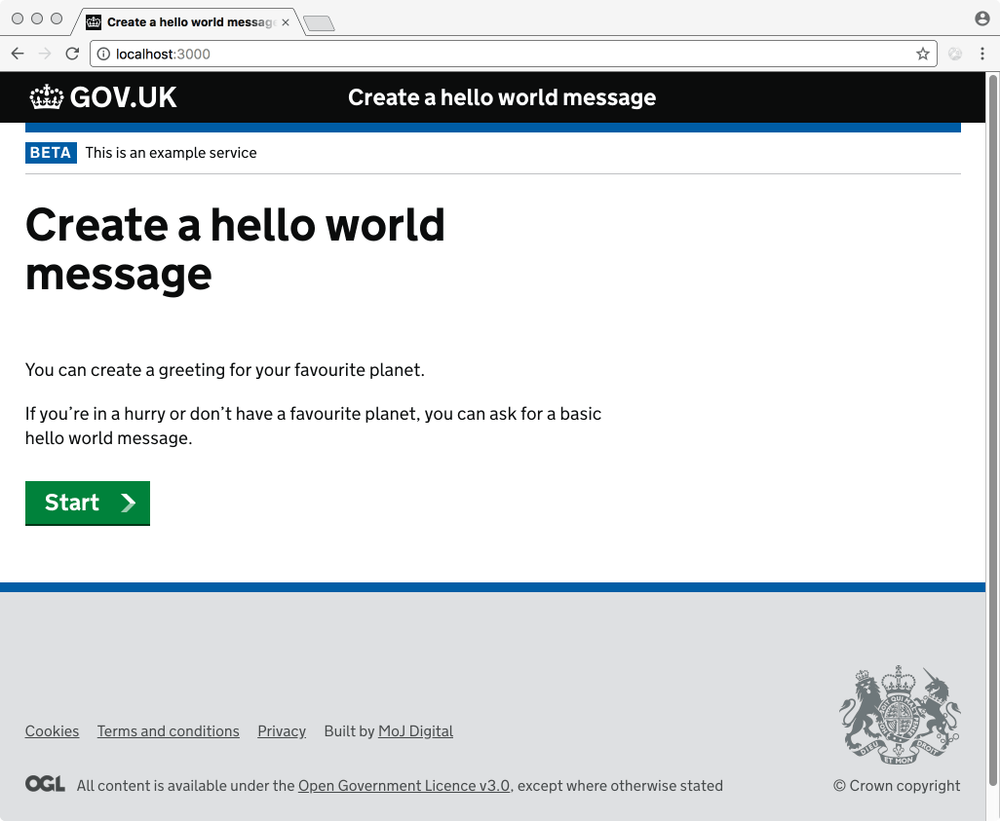
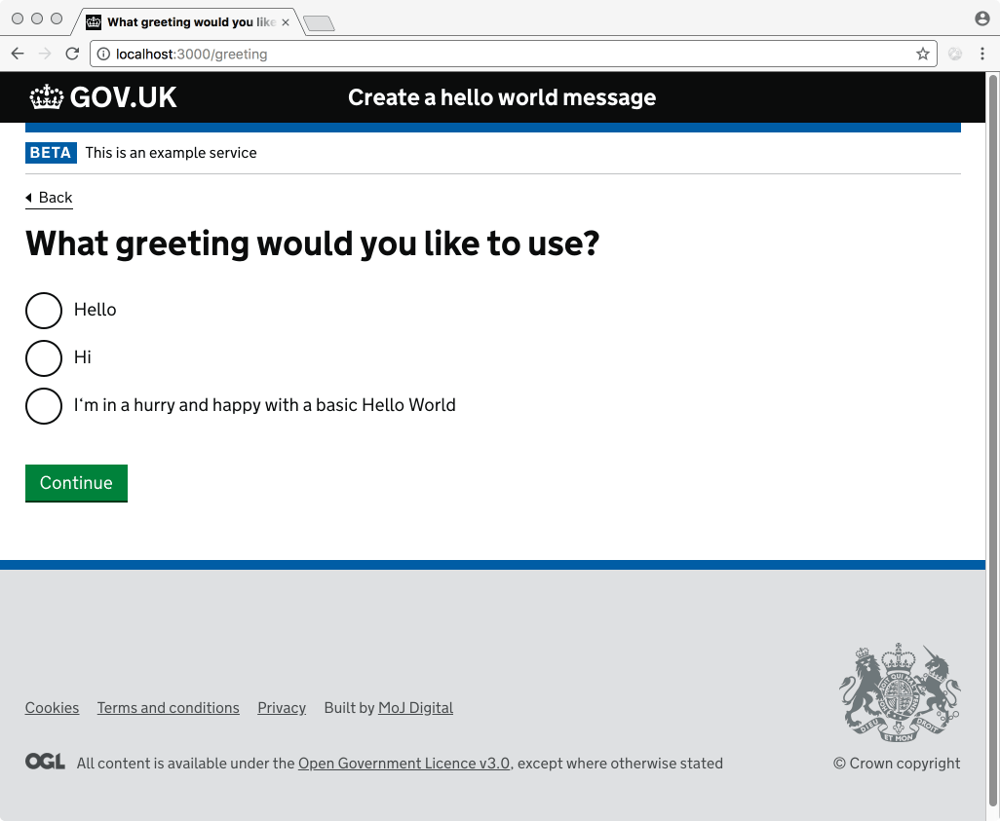
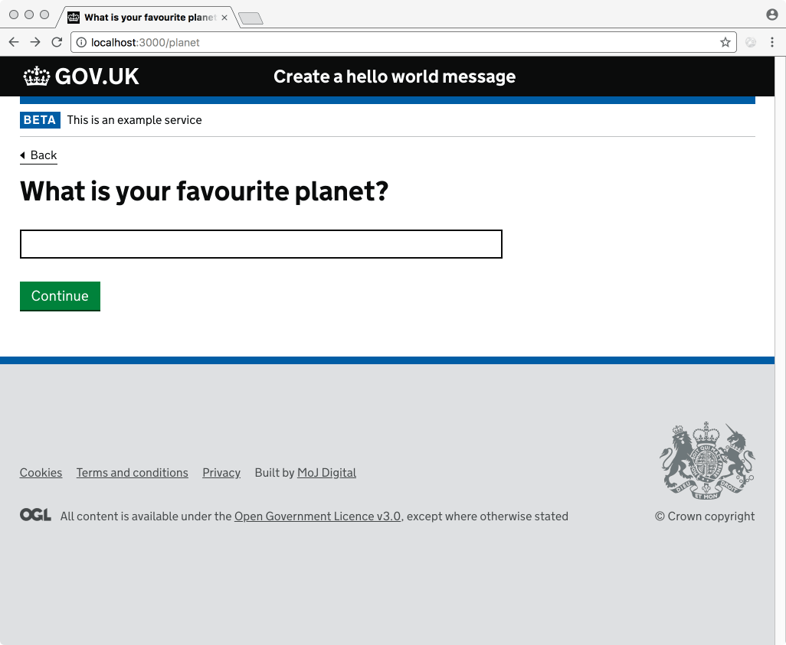
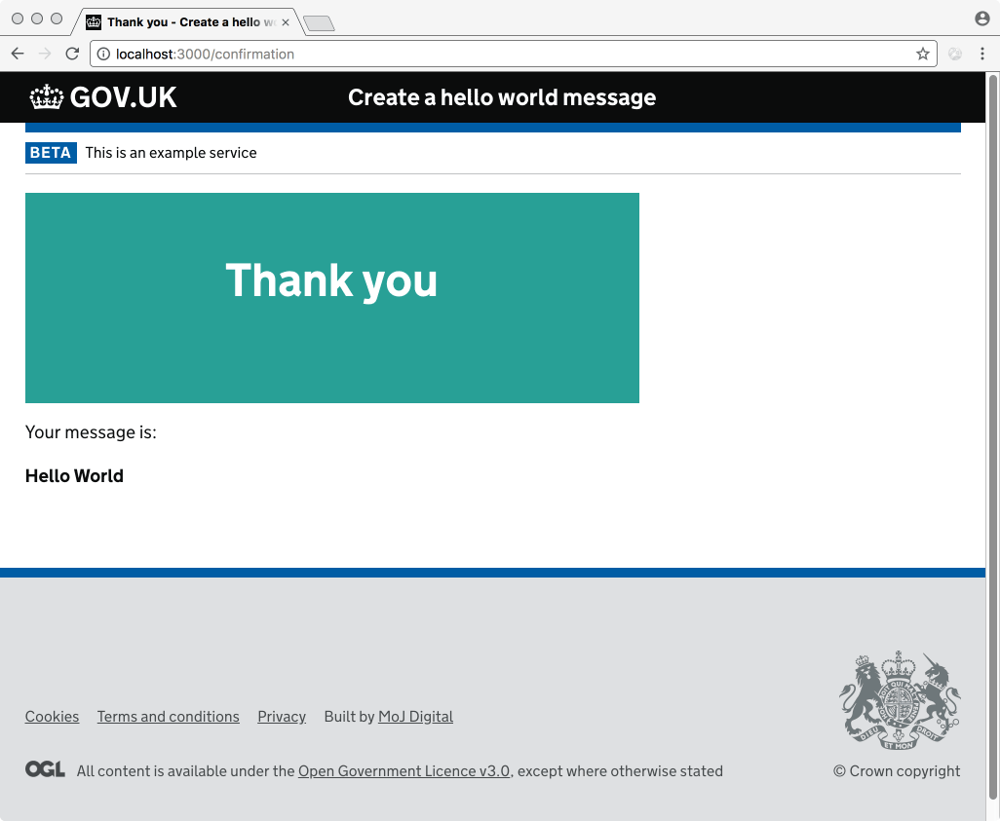

# Simple example service

The following files define a simple service that presents

- a start page
- a page that asks the user for a greeting to address the planet with
- a page that asks the user for their favourite planet
- a confirmation page that replays the user’s answers


## Service pages

## Start page - `pageStartExample.json`



```
{
  "_id": "pageStartExample",
  "_type": "page.start",
  "url": "/",
  "heading": "Create a hello world message",
  "body": "You can create a greeting for your favourite planet.\n\nIf you’re in a hurry or don’t have a favourite planet, you can ask for a basic hello world message.",
  "steps": [
    "pageGreeting",
    "pagePlanet",
    "pageConfirmation"
  ]
}
```

The `steps` property determines the [flow](flow) (the user‘s journey through the service).

Note that the body text (and all other content strings) are [formatted using Markdown](i18n).


### Page asking for greeting - `pageGreeting.json`



```
{
  "_id": "pageGreeting",
  "_type": "page.singlequestion",
  "url": "/greeting",
  "components": [{
    "_id": "pageGreeting--greeting",
    "_type": "radios",
    "name": "greeting",
    "label": "What greeting would you like to use?",
    "items": [
      {
        "_id": "pageGreeting--greeting--hello",
        "_type": "radio",
        "value": "Hello",
        "label": "Hello"
      },
      {
        "_id": "pageGreeting--greeting--hi",
        "_type": "radio",
        "value": "Hi",
        "label": "Hi"
      },
      {
        "_id": "pageGreeting--greeting--hurry",
        "_type": "radio",
        "value": "Hello World",
        "label": "Just give me a basic Hello World"
      }
    ]
  }]
}
```

A [single question page](/page/pageSingleQuestion) with a [radios component](/component/radios).

### Page asking for planet - `pagePlanet.json`



```
{
  "_id": "pagePlanet",
  "_type": "page.singlequestion",
  "url": "/planet",
  "components": [{
    "_id": "pagePlanet--planet",
    "_type": "text",
    "name": "planet",
    "label": "What is your favourite planet?"
  }],
  "show": {
    "identifier": "greeting",
    "operator": "is",
    "value": "Hello World",
    "negated": true
  }
}
```

If the value of the previous greeting question is "Hello World" (ie. the user did not select "Just give me a basic Hello World"), this page is skipped and the user is redirected to the next page.

Read more about [logic and conditions](conditions) and [page flow](flow)


### Confirmation page - `pageConfirmation.json`



```
{
  "_id": "pageConfirmation",
  "_type": "page.confirmation",
  "url": "/confirmation",
  "heading": "Thank you",
  "body": "Your message is:\n\n**{greeting} {planet}**"
}
```

The greeting message is shown to the user.

[Values provided by the user are substituted](i18n).


## Configuration of the service

The name of the service and the text that appears in the phase banner are defined in the service's [Service block](/configuration/service).

`service.json`

```
{
  "_id": "service",
  "_type": "service",
  "name": "Create a hello world message",
  "phase": "beta",
  "phaseText": "This is an example service"
}
```
