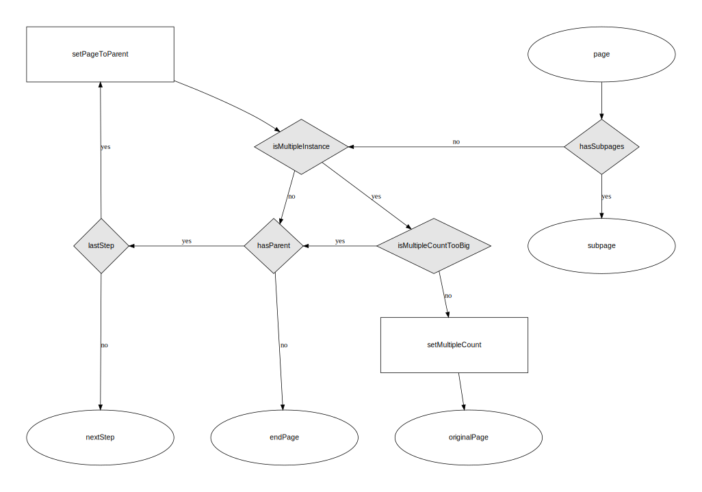

# Page flow

A service is built out of [pages](page), or more specifically, is the sequential flow between the pages defined as the steps of a service entry point.

## Entry points

Any page that has steps and is not contained in another page’s steps is considered an entry point to the service.

Typically there should be one service entry point and it should be a [`Start page`](/page/pageStart).

## Determining the flow (in principle)

The flow through the service is determined by:

- starting at the entry point
- moving through the pages that are referenced as its steps
- recursing into any steps encountered on any of those pages
- looping over multiple page instances
- short-circuiting this process if an explicit nextPage is defined 

*TODO: Include explicit nextPage in diagram, update labels*

## Determining the flow (precise rules)

After the successful submission of a page (ie. without any validation errors), the system determines what page (if any) the user should be redirected to according to the following rules.

[](images/page-flow.svg)

```
1. Does the initial page have an explicit nextPage?

- 1. Yes
  2. Does the nextPage value still have a value after it is evaluated?

  - 2. Yes
    Go to page defined as nextStep
    Stop

  - 2. No
    Skip to 3.

- 1. No
  Skip to 3.

3. Does the initial page have steps?

- 3. Yes
  Go to the page defined as the first step
  Stop

- 3. No
  Skip to 4.

4. Should the page have multiple instances?

- 4. Yes
  5. Is the current multiple instance counter higher than the max allowed?

  - 5. No
    Increment the multiple instance counter go to the initial page
    Stop

  - 5. Yes
    Skip to 5.

- 4. No
  6. Is the page contained in another page’s steps?

  - 6. Yes
    7. Is the page the last step of the containing page?

    - 7. Yes
      Set page to the containing page and return to 3.

    - 7. No
      Go to the page that is the next step
      Stop

  - 6. No
    Go to self (end of service)
    Stop


```

## Explicit `nextPage`

By default `nextPage` is undefined - figuring out which page to redirect to will start at step 3 outlined above.

This property can either be the value of a page’s `_id` or an array of nextPageCondition objects.

(In the following examples, properties other than `nextPage` have been omitted for clarity)


```
{
  ...
  "nextPage": "pageA"
}
```

This example will always redirect to pageA
 
```
{
  ...
  "nextPage": [
    {
      "page": "pageA",
      "condition": {
        "identifier": "foo",
        "operator": "is",
        "value": "bar"
      }
    }
  ]
}
```

This example will redirect to pageA if the user-submitted value for foo is bar. If the condition evaluates to false, the rules explained above will be followed to determine the next page.

```
{
  ...
  "nextPage": [
    {
      "page": "pageA",
      "condition": {
        "identifier": "foo",
        "operator": "is",
        "value": "bar"
      }
    },
    {
      "page": "pageB",
      "condition": true
    }
  ]
}
```

This example will redirect to pageA if the user-submitted value for foo is bar the same as the previous example, but provides a fallback to redirect to pageB since the condition always evaluates to true.

[Read more about conditions](logic)

[View the nextPage definition](/definition/nextPage)

## Skipping pages

A page will be skipped under any of the following situations

- the page has a `show` property that evaluates to false
- all top-level components on the page have `show` properties and they all evaluate to false
- the page’s parent page has a `show` property that evaluates to false
- the page’s parent page has a `stepShow` property that evaluates to false

If a page is skipped, the user is redirected to the next page in the flow.

(NB. not the skipped page’s `nextPage`, even if it has one)

*I feel a diagram coming on*

