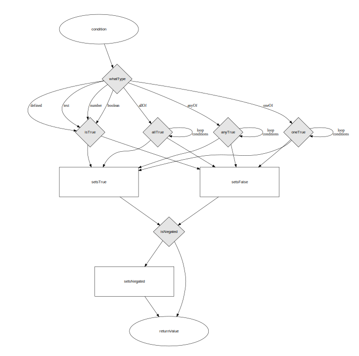

# Conditions and logic

Conditions are the fundamental data structure allowing Form Builder to handle logic. 

They provide the consistent mechanism that underpins the [page flow](flow), by determining whether to

- [show or hide a block](block-show) (via the `show` property)
- [perform an explicit page redirect](flow) (via the `nextPage` property)

They also determine whether a control should be 
- [required](validation) (via the `required` property)
- disabled (via the `disabled` property)

A condition can be either:

- a single expression or
- a group of conditions
  - that must all evaluate to true
  - of which at least one must evaluate to true
  - of which only one can evaluate to true

(this is similar to allOf, anyOf and oneOf in JSON Schema)

Any condition (single expression or group) can be negated.

Whether a condition evaluates to true or not can be seen in the following diagram.

[View the condition definition](/definition/condition)