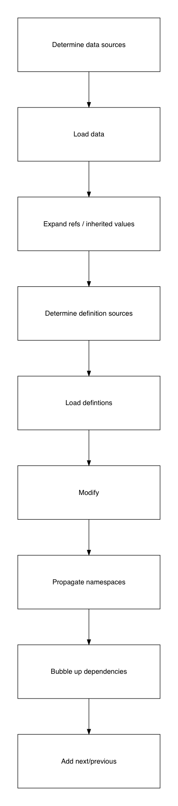
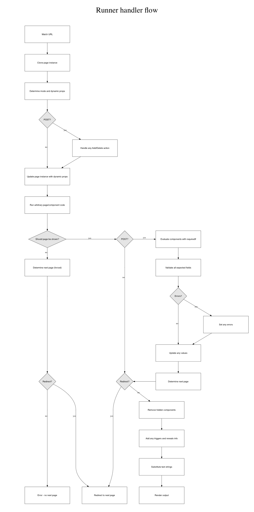

# Rendering forms / capturing data

## Form Builder Runner

The [Runner](https://github.com/ministryofjustice/fb-runner-node) renders the form and captures the input required from users by processing the form’s data using generic code.

### Runtime representation

From the buildtime representation we generate a runtime representation.

- Determine data sources
- Load data
- Expand refs / inherited values
- Determine definition sources
- Load defintions
- Modify data
- Propagate namespaces
- Bubble up dependencies
- Add next/previous pages

### Handling user requests

Using this representation, a runner can map urls to the relevant page.

When a user visits a page, the runner

- Finds page instance corresponding to the requested route
- Checks that the page should be displayed
- Performs any necessary validation
- Performs any transaction / code
- Update instance representation
- Perform substitution of strings
- Pass instance representation to template renderer