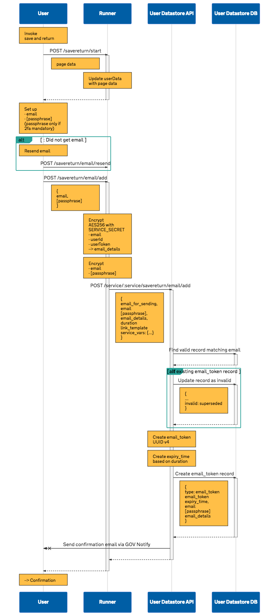
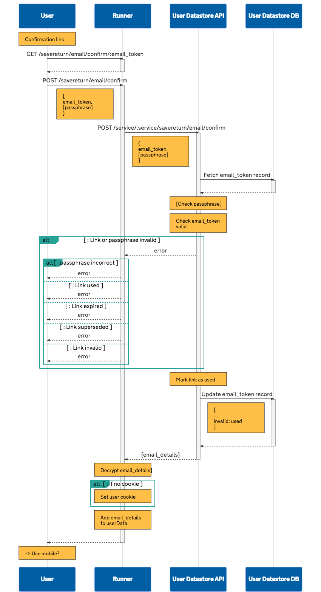
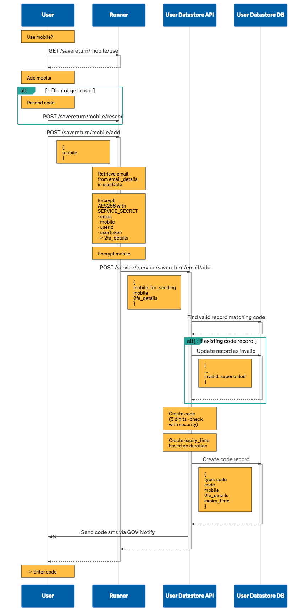
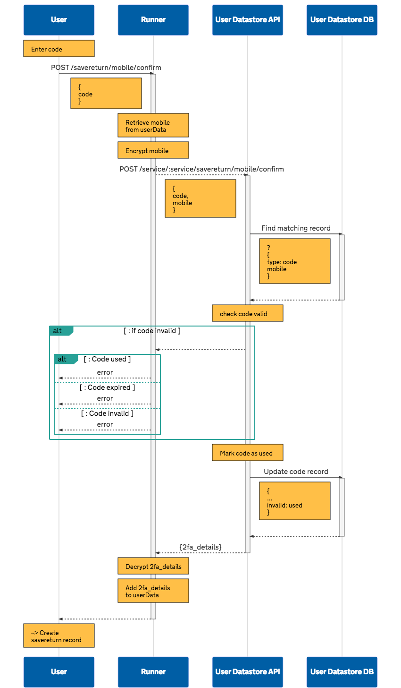
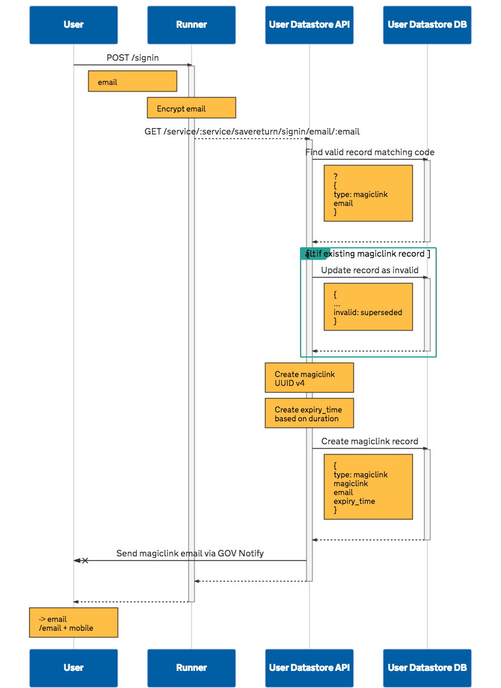
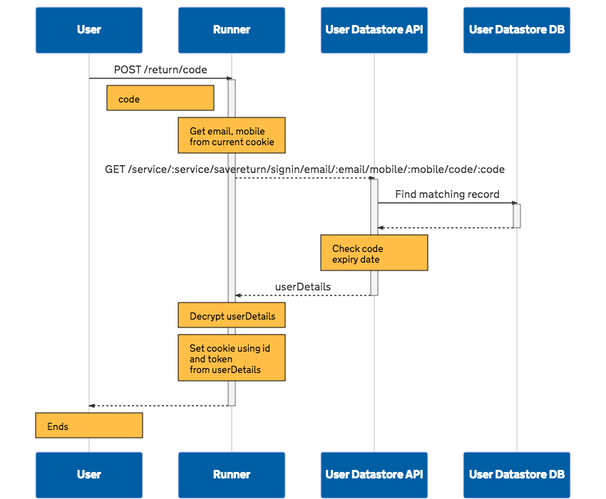

# Save and return

NB. this is still a draft

## TOC

- [Error responses](#error-responses)
- [Signing requests](#signing-requests)

### Save

- [Create email token for user to confirm email](#create-email-token-for-user-to-confirm-email)
- [Confirm user’s email](#confirm-users-email-address)
- [Create code for user to confirm mobile](#create-code-for-user-to-confirm-mobile)
- [Confirm user’s mobile](#confirm-users-mobile-address)
- [Create save and return record for user](#create-save-and-return-record-for-user)

### Return

- [Create magiclink for user](#create-magiclink-for-user)
- [Confirm user’s magiclink](#confirm-users-magiclink)
- [Confirm user’s signin code](#confirm-users-signin-code)

## Preface 

### Error responses

Error responses should be sent as JSON - see [Error responses](error-responses.md)

###  Signing requests

Requests should be signed with JWT - see [Signing requests with JWT](request-signing-with-jwt.md)

### Invalidating records


```
{
  ...
  invalid: superseded
}
```

## Save

### Create email token for user to confirm email

  - create email token
  - invalidate previous tokens
  - store encrypted email details
  - send email

`POST /service/:service/savereturn/email/add`

Expected body

```
{
  email_for_sending,
  email,
  [passphrase],
  email_details,
  duration: {number} minutes|hours?,
  link_template: {string},
  [service_vars: {}]
}
```

#### Mark previous tokens as superseded

#### Generate email_token

UUID v4

#### Generate expiry_time

Current time + duration (minutes|hours?)


#### Create email token record

```
{
  type: "email_token",
  email_token,
  expiry_time,
  email,
  [passphrase],
  email_details
}
```

[](images/save-return--email-add.svg)

### Confirm user’s email address

/service/:service/savereturn/email/confirm
  - confirm email token validity
  - return error codes
  - mark email token used
  - return encrypted email details

[](images/save-return--email-confirmation.svg)


### Create code for user to confirm mobile

/service/:service/savereturn/mobile/add
  - create code
  - invalidate previous codes
  - store encrypted 2fa details
  - send sms

[](images/save-return--mobile-add.svg)

### Confirm user’s mobile

/service/:service/savereturn/mobile/confirm
  - confirm code validity
  - return error codes
  - mark code used
  - return encrypted 2fa details

[](images/save-return--mobile-confirm.svg)

### Create save and return record for user

/service/:service/savereturn/create
  - create savereturn details

[](images/save-return--create-record.svg)


## Return

### Create magiclink for user

/service/:service/savereturn/signin/email/:email
  - create magiclink
  - invalidate previous magiclinks
  - store savereturn key (email)
  - send email

[](images/save-return--signin-start.svg)


### Confirm user’s magiclink

/service/:service/savereturn/signin/magiclink/:magiclink
  - confirm magiclink validity
  - return error codes
  - return savereturn details if email only
  - create signin code if 2fa
  - invalidate previous signin codes
  - store savereturn key (email)
  - send sms

[](images/save-return--signin-magiclink.svg)


### Confirm user’s signin code

/service/:service/savereturn/signin/email/:email/mobile/:mobile/code/:code
  - confirm siginin code validity
  - return error codes
  - mark signin code used
  - return savereturn details

[](images/save-return--signin-code.svg)
