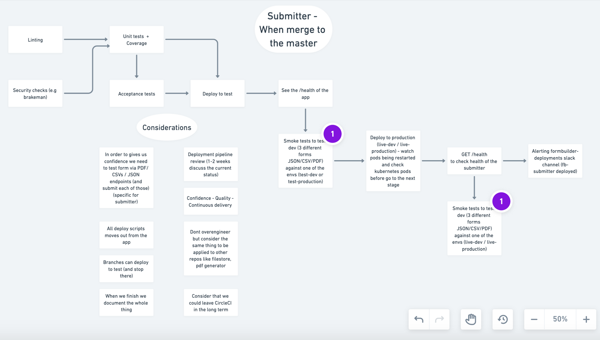

# Deployments Imagineering session 2
Created by Tomas Destefi 02 April 2020

In the last two retros we talked about how our deployments need a lot of improvements. So 02/04 Me, Brendan and Matt did the session 2 of the Deploy imagineering session.

## Proposal
We want to improve our deployment in all the following applications (sort by level of priority):
1. The submitter app (application responsible to handle submissions)
2. The runner app (application responsible to show the forms to the end user)
3. The user datastore app (application responsible to handle the user data)
4. The user filestore app (application responsible to handle user uploads)
5. The pdf generator app (application responsible to generate pdfs for submitter)
6. The service token cache app (application responsible to make all APIs to communicate with each other)
7. The publisher app (app responsible of publishing the forms)

## Benefits of this work
When this work is finished we:
1. We will have more confident on our deployments.
2. We will deploy apps with more quality.
3. We are adding extra checks before and after it goes live so we can make sure everything worked.
4. Low risk releases.
5. We substantially reduce the cost of making and delivering incremental changes to software by eliminating many of the fixed costs associated with the release process.
6. Faster Mean Time To Resolution.
7. More test reliability.
8. We can implement Continuous Delivery.

## The first part of the work - Submitter
We decided to start implementing the pipeline we envision on the submitter app.

You can see step by step of the deployment pipeline (from left to right with some considerations).

## Trello cards for the submitter
Most of the trello cards were created with the assumption that they are small self contained deliverables, so we don't need to wait for the whole work to be finished, we can reap the benfits slowly and gradually. The trello cards for the submitter:
1. [https://trello.com/c/3IU1ZDGd/401-add-linting-to-submitter](https://trello.com/c/3IU1ZDGd/401-add-linting-to-submitter)
2. [https://trello.com/c/9SlgedcE/403-add-security-checks-to-submitter](https://trello.com/c/9SlgedcE/403-add-security-checks-to-submitter)
3. [https://trello.com/c/LYR2uUFl/404-unit-tests-to-submitter](https://trello.com/c/LYR2uUFl/404-unit-tests-to-submitter)
4. [https://trello.com/c/4QZ4Ij4W/405-add-acceptance-tests-to-submitter](https://trello.com/c/4QZ4Ij4W/405-add-acceptance-tests-to-submitter)
5. [https://trello.com/c/dPN1czRI/406-epic-improve-performance-of-acceptance-tests](https://trello.com/c/dPN1czRI/406-epic-improve-performance-of-acceptance-tests)
6. [https://trello.com/c/FMif8M9d/409-add-healthcheck-step-to-submitter-test-environment](https://trello.com/c/FMif8M9d/409-add-healthcheck-step-to-submitter-test-environment)
7. [https://trello.com/c/HBvyPbGB/407-add-smoke-tests-to-test-environment-after-the-deploy-to-test-is-complete](https://trello.com/c/HBvyPbGB/407-add-smoke-tests-to-test-environment-after-the-deploy-to-test-is-complete)
8. [https://trello.com/c/RIBLnCYY/408-watch-pods-being-restarted-in-production-for-the-formbuilder-platform-live-dev-and-formbuilder-platform-live-production](https://trello.com/c/RIBLnCYY/408-watch-pods-being-restarted-in-production-for-the-formbuilder-platform-live-dev-and-formbuilder-platform-live-production)
9. [https://trello.com/c/4hPTxwtd/410-add-healthcheck-step-to-submitter-production-environment](https://trello.com/c/4hPTxwtd/410-add-healthcheck-step-to-submitter-production-environment)
10. [https://trello.com/c/qBo0i1wZ/411-add-smoke-tests-to-test-environment-after-the-deploy-production-is-complete](https://trello.com/c/qBo0i1wZ/411-add-smoke-tests-to-test-environment-after-the-deploy-production-is-complete)
11. [https://trello.com/c/fwgQaChQ/412-alert-channel-about-submitter-pipeline-result](https://trello.com/c/fwgQaChQ/412-alert-channel-about-submitter-pipeline-result)
12. [https://trello.com/c/nFlzcHv7/413-branches-can-deploy-to-test-on-submitter](https://trello.com/c/nFlzcHv7/413-branches-can-deploy-to-test-on-submitter)

## After the work above is done
After the work above is done we need to apply the same changes to other repositories like the Runner, the file store, datastore, and so on.

## Considerations for the developers
1. Don't overengineer but consider the same pipeline process to be applied to other repos like filestore, pdf generator so when doing for submitter the other could be easier to plug in.
2. Branches can deploy to test (and stop there)
3. Consider that we could leave CircleCI in the long term
4. Branches can deploy to test (and stop there)
5. In order to give us the confidence we need to test form via PDF/ CSVs / JSON endpoints (and submit each of those) (specific for submitter)
6. After this work is started me (Tomas, Brendan and Matt) will review how is going what we agreed.
